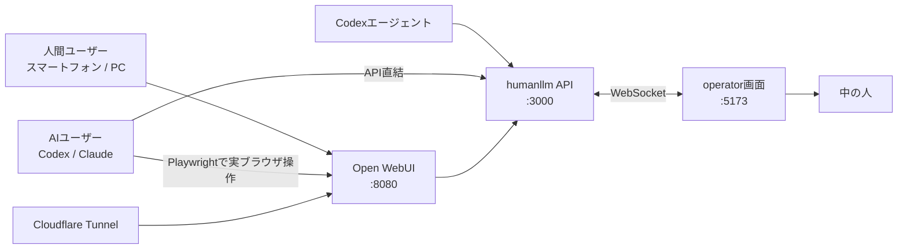

# 人間LLM / ningen-1

**OpenAI API互換の、人間で動く言語モデル。**

ChatGPT風の画面からメッセージを送ると、別室の人間に届きます。人間が読んで、調べて、考えて、返答します。ストリーミング、思考表示、画像、Web検索、コード実行にもだいたい対応しています。

```text
OpenAI API-compatible LLM powered by YOU.
```

本プロジェクトは[Syuparn/humanllm](https://github.com/Syuparn/humanllm)をベースに、Open WebUI接続、スマートフォン公開、途中経過、ツール実行、AIユーザーモードなどを追加したものです。

## できること

- **人間 → 人間**: スマートフォンやPCのOpen WebUIから質問し、operator画面の人間が回答
- **Codex → 人間**: Codexがhumanllmをモデルとして利用し、人間へタスクを送信
- **AIユーザー → 人間**: CodexまたはClaudeがユーザー役になり、人間への質問を自律的に続ける
- OpenAI互換の`/v1/chat/completions`と`/v1/responses`
- SSEストリーミングと`<think>`形式の途中経過表示
- 画像のドラッグ&ドロップと自動縮小
- Open WebUIのWeb検索、Code Interpreter、カスタムshell toolとの連携
- Cloudflare Quick Tunnelによるスマートフォン向け一時公開
- AI→人間会話のJSONL保存


## 構成




Open WebUIは利用者向けのChatGPTライクな画面です。operator画面は中の人だけが使う受信・回答画面です。

## 必要なもの

現在の開発環境はWindowsを前提にしています。

- Node.js 20以降
- npm
- [uv](https://docs.astral.sh/uv/)（Open WebUI用Python 3.11環境の管理）
- Codex CLI（Codex連携を使う場合）
- Anthropic APIキー（ClaudeをAIユーザーにする場合のみ）
- cloudflared（外部公開する場合のみ）


## セットアップ

プロジェクトルートで依存関係をインストールします。

```powershell
npm install
npm --prefix humanllm install
```

`uv`が未導入の場合:

```powershell
python -m pip install uv
```


## 起動


### サーバーとOpen WebUIをまとめて起動

```powershell
npm run dev
```

起動後:

- Open WebUI: [http://localhost:8080/](http://localhost:8080/)
- operator画面: [http://localhost:5173/](http://localhost:5173/)
- humanllm API: [http://localhost:3000/v1](http://localhost:3000/v1)

`5173`が使用中の場合、operator画面は`5174`などへ自動的に移動します。ターミナルに表示されたURLを確認してください。

### 個別に起動


| コマンド                 | 内容                                      |
| -------------------- | --------------------------------------- |
| `npm run dev:server` | humanllm APIとoperator画面                 |
| `npm run dev:client` | Open WebUI                              |
| `npm run openwebui`  | `dev:client`の別名                         |
| `npm run tunnel`     | Open WebUIをCloudflare Quick Tunnelで一時公開 |


## Open WebUIの初期設定

1. [http://localhost:8080/](http://localhost:8080/)を開き、管理者アカウントを作成
2. 管理者設定の「OpenAI API接続」に接続先を追加
3. URLを`http://localhost:3000/v1`に設定
4. APIキーには任意のダミー値を入力（例: `ningen`）
5. モデル一覧から`human`を選択
6. operator画面を開いた状態でメッセージを送る

Open WebUIのデータは次の場所に保存されます。

```text
C:\Users\<ユーザー名>\AppData\Local\open-webui\data
```


## Codexから人間LLMを使う

`~/.codex/humanllm.config.toml`を作成します。

```toml
model = "human"
model_provider = "humanllm"

[model_providers.humanllm]
name = "Human LLM"
base_url = "http://localhost:3000/v1"
bearer_token_env_var = "HUMANLLM_API_KEY"
```

humanllmを起動後、別ターミナルで実行します。

```powershell
$env:HUMANLLM_API_KEY = "dummy"
codex --profile humanllm
```

Codexから届いたプロンプトにoperator画面で回答すると、その回答がCodexにモデル出力として戻ります。

## AIをユーザー役にする

AIが質問を生成し、人間の回答を読み、次の質問を作るモードです。Open WebUIは不要ですが、humanllm APIとoperator画面を起動しておく必要があります。

```powershell
npm run dev:server
```


### Codexを使う

```powershell
npm run ai-user:codex
```

保存済みのCodex認証を利用します。APIキーは不要です。

### Claudeを使う

```powershell
$env:ANTHROPIC_API_KEY = "sk-ant-..."
npm run ai-user:claude
```

会話テーマや回数も変更できます。

```powershell
$env:AI_USER_MAX_TURNS = "10"
$env:AI_USER_TOPIC = "人がAIに普段どんなことを頼みたいのかを探る"
$env:AI_USER_PERSONA = "少しせっかちで、曖昧な回答には具体例を求める"
npm run ai-user:codex
```

会話ログは`data/ai-user/*.jsonl`に保存されます。詳細は[AIユーザーモード](docs/30_ai-user.md)を参照してください。

### AIがOpen WebUIを実ブラウザで操作する

API直結とは別に、Playwrightが専用のChromeを開き、AIの発言をOpen WebUIへ実際に入力する展示用モードがあります。

```powershell
# Codex → Chrome → Open WebUI → humanllm → 人間
npm run ai-user:codex:webui

# Claude → Chrome → Open WebUI → humanllm → 人間
$env:ANTHROPIC_API_KEY = "sk-ant-..."
npm run ai-user:claude:webui
```

初回だけ、開いたChromeでOpen WebUIへログインしてください。ログイン状態は`data/ai-user-browser-profile/`へ保存され、次回から再利用されます。`human`モデルはスクリプトが自動選択します。

このモードでは、AIが文字を入力して送信し、Open WebUIに描画された返答を読み取ります。そのため、チャット履歴、Markdown、数式、画像、`<think>`の途中経過などを観客がOpen WebUI上で見る演出に利用できます。折りたたまれた途中経過は次の質問を作るAIには渡さず、画面上の最終回答を渡します。

## スマートフォンからアクセスする

Open WebUIを起動後、別ターミナルで実行します。

```powershell
npm run tunnel
```

ターミナルに表示される`https://...trycloudflare.com`をスマートフォンで開きます。

Quick Tunnelには次の制約があります。

- URLは起動するたびに変わる
- PC、Open WebUI、cloudflaredが動いている間だけアクセスできる
- URLを知っている人はログイン画面に到達できる
- 常設公開ではCloudflare Accessや名前付きトンネルなど、追加の認証を推奨


## operator画面の機能

- **通知音**: 新しいプロンプト受信時にチャイムを再生。ヘッダーの`SOUND ON/OFF`で切り替え、設定をブラウザに保存
- **Send progress**: 途中経過を`<think>`ブロックとして送信
- **Send**: 最終回答を送信
- **Run Command**: Open WebUI/Codexへshell tool callを返す
- **Web Search**: Open WebUIの`search_web`を発火
- **Code Interpreter**: Open WebUIのPyodideコード実行を発火
- **画像D&D**: 画像を縮小し、Markdown data URIとして送信

Open WebUI用のshell toolコードは[openwebui-tools/shell_command.py](openwebui-tools/shell_command.py)にあります。任意コマンドを実行できるため、信頼できない利用者に公開する環境では特に注意してください。

新しいOpen WebUI環境では、必要な機能を管理画面から有効化します。

- **Shell**: Workspace → Toolsで新規Toolを作り、`shell_command.py`の内容を登録。`human`モデルのToolsで有効化
- **Web検索**: 管理者設定でWeb Searchを有効化し、検索エンジンを設定（APIキー不要で試す場合はDuckDuckGo）
- **Code Interpreter**: 管理者設定でCode Interpreterを有効化し、Pyodideを選択
- Web検索とCode Interpreterは、利用するチャットの「+」メニューでも機能をオンにする


## npm scripts


| コマンド                           | 説明                           |
| ------------------------------ | ---------------------------- |
| `npm run dev`                  | humanllmとOpen WebUIを同時起動     |
| `npm run dev:server`           | humanllm API + operator画面    |
| `npm run dev:client`           | Open WebUI                   |
| `npm run tunnel`               | Cloudflare Quick Tunnel      |
| `npm run ai-user:codex`        | CodexをAIユーザーとして起動            |
| `npm run ai-user:claude`       | ClaudeをAIユーザーとして起動           |
| `npm run ai-user:codex:webui`  | CodexがChrome上のOpen WebUIを操作  |
| `npm run ai-user:claude:webui` | ClaudeがChrome上のOpen WebUIを操作 |


## セキュリティとデータ

- `shell_command`はOpen WebUIを実行しているPC上で任意コマンドを実行します
- operator画面とhumanllm APIは原則として直接インターネット公開しないでください
- Open WebUIではサインアップを無効化し、強いパスワードを設定してください
- プロンプト、回答、画像、AIユーザー会話には個人情報が含まれる可能性があります
- データセットとして公開・展示へ利用する場合は、同意、匿名化、削除手段を設計してください
- `.webui_secret_key`、Open WebUIデータ、AIユーザーログはGitへコミットしないでください


## プロジェクト構成

```text
.
├─ humanllm/          # OpenAI互換API、operator用React UI、WebSocket
├─ openwebui-tools/   # Open WebUI用カスタムTool
├─ scripts/           # Tunnel、AIユーザーモード
├─ docs/              # 設計、コンセプト、展示検討、モデルカード
├─ data/              # ローカルデータ（Git対象外を含む）
└─ package.json       # 統合起動コマンド
```


## ドキュメント

- [技術サーベイ](docs/00_survey.md)
- [アーキテクチャと実装方針](docs/01_design.md)
- [コンセプトノート](docs/10_concept.md)
- [展示・演出案](docs/11_staging.md)
- [ningen-1 モデルカード](docs/20_ningen-1-modelcard.md)
- [AIユーザーモード](docs/30_ai-user.md)


## ningen-1


| 項目          | 値                   |
| ----------- | ------------------- |
| アーキテクチャ     | 生物学的ニューラルネットワーク     |
| 学習データ       | 実体験、読書、母の教え、インターネット |
| temperature | 36.6                |
| コンテキスト長     | 直近3件程度（メモで拡張可能）     |
| 同時実行        | 1                   |
| SLA         | 保証しません              |


詳しくは[モデルカード](docs/20_ningen-1-modelcard.md)をご覧ください。

## ライセンスとクレジット

ベースとなったhumanllmはSyuparn氏によるMIT Licenseのプロジェクトです。ライセンス本文は[humanllm/LICENSE](humanllm/LICENSE)を参照してください。

- Original: [Syuparn/humanllm](https://github.com/Syuparn/humanllm)
- Article: [【永久0円】人間LLMのすすめ](https://qiita.com/Syuparn/items/0001f93221d4d7556271)

